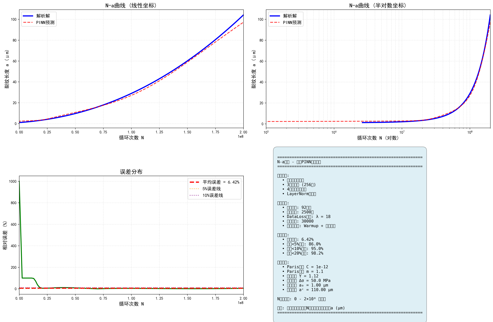
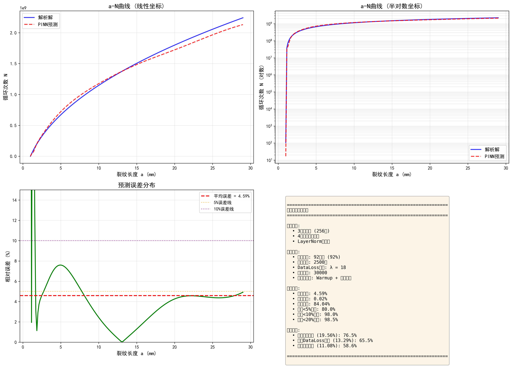

<div align="center">

# 疲劳裂纹扩展预测 | PINN-Fatigue-Crack-Prediction

### PINN-based fatigue crack growth prediction.

Physics-informed neural network with Paris-law constraints — ~6.42% average prediction error from sparse data.

[](LICENSE)
[](https://www.python.org/)
[](https://pytorch.org/)

</div>

---

**PINN-Fatigue-Crack-Prediction** predicts **fatigue crack growth** with a **physics-informed neural network** constrained by the **Paris law**, achieving **~6.42% average error** vs analytical solutions — from just 92 training points.

> [!NOTE]
> 中文项目：基于物理信息神经网络（PINN）的疲劳裂纹扩展预测——Paris 方程物理约束，平均误差 6.42%，仅 92 个数据点。

---

## Features

- **PINN model** — deep learning with physics constraints.
- **Paris-law constraint** — physics-informed crack-growth modeling.
- **Data-efficient** — 92 sparse training points (log-uniform).
- **Accurate** — ~6.42% average error vs analytical solution.
- **Modular** — easy to tune physical params & network structure.

---

## Quickstart

```bash
git clone https://github.com/Windyhhh/PINN-Fatigue-Crack-Prediction.git
cd PINN-Fatigue-Crack-Prediction

pip install -r requirements.txt

python src/train.py          # train the PINN
python src/predict.py        # predict crack growth
```

---

## Project Structure

```
PINN-Fatigue-Crack-Prediction/
├── src/                    # PINN model, training, prediction
├── data/                   # sparse training points
├── configs/                # physical params
└── docs/                   # usage, blog
```

---


## Results

<div align="center">
  
  
</div>

---
## License

MIT — free to use, modify and distribute.
