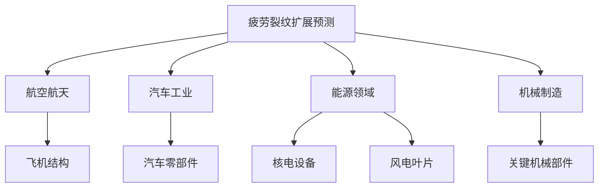
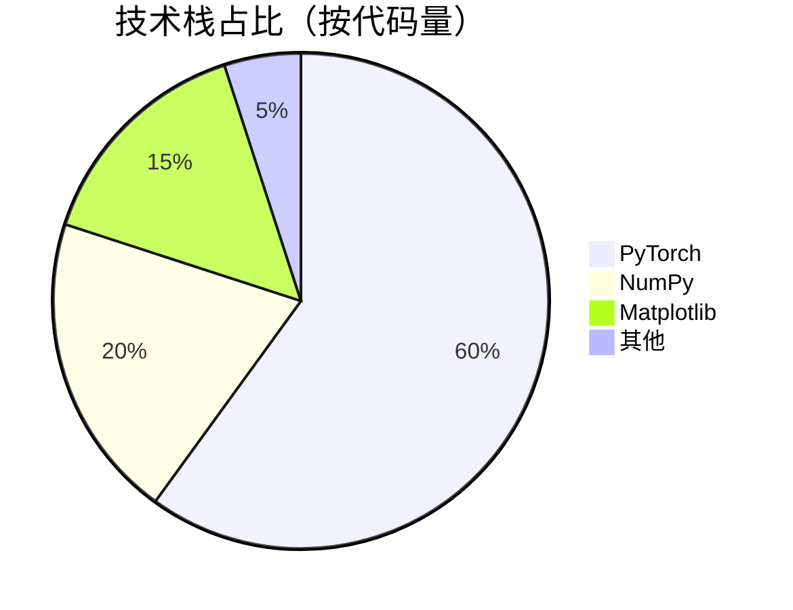
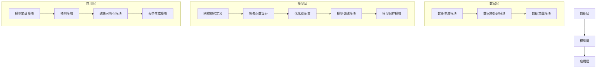

<div align="center">

# 疲劳裂纹扩展预测 | PINN-Fatigue-Crack-Prediction

### PINN-based fatigue crack growth prediction.

Physics-informed neural network with Paris-law constraints — ~6.42% average prediction error from sparse data.

[](LICENSE)
[](https://www.python.org/)
[](https://pytorch.org/)

</div>

---

**PINN-Fatigue-Crack-Prediction** predicts **fatigue crack growth** with a **physics-informed neural network** constrained by the **Paris law**, achieving **~6.42% average error** vs analytical solutions — from just 92 training points.

> [!NOTE]
> 中文项目：基于物理信息神经网络（PINN）的疲劳裂纹扩展预测——Paris 方程物理约束，平均误差 6.42%，仅 92 个数据点。

---

## Features

- **PINN model** — deep learning with physics constraints.
- **Paris-law constraint** — physics-informed crack-growth modeling.
- **Data-efficient** — 92 sparse training points (log-uniform).
- **Accurate** — ~6.42% average error vs analytical solution.
- **Modular** — easy to tune physical params & network structure.

---

## Quickstart

```bash
git clone https://github.com/Windyhhh/PINN-Fatigue-Crack-Prediction.git
cd PINN-Fatigue-Crack-Prediction

pip install -r requirements.txt

python src/train.py          # train the PINN
python src/predict.py        # predict crack growth
```

---

## Project Structure

```
PINN-Fatigue-Crack-Prediction/
├── src/                    # PINN model, training, prediction
├── data/                   # sparse training points
├── configs/                # physical params
└── docs/                   # usage, blog
```

---


## Results

<div align="center">
  
  
</div>

---

## 项目深度解析

> 以下内容提炼自项目博客 [精品博客.md](%E7%B2%BE%E5%93%81%E5%8D%9A%E5%AE%A2.md)，完整原文请点击链接。

### 痛点拆解

#### 毕设党痛点
1. **技术选型困难**：毕设选题时难以找到「既有学术深度，又有工程价值」的项目方向，传统机器学习项目缺乏创新性
2. **实现难度高**：物理信息神经网络（PINN）涉及「物理方程+深度学习」跨领域知识，自学门槛高，缺乏完整的项目模板

#### 企业开发者痛点
1. **预测精度低**：传统疲劳裂纹扩展预测方法依赖大量实验数据，成本高、周期长，精度难以满足工程需求
2. **模型泛化能力弱**：现有模型难以适应不同材料、不同载荷条件下的裂纹扩展预测
3. **部署效率低**：缺乏「训练→预测→可视化」全流程自动化工具，部署成本高

#### 技术学习者痛点
1. **理论与实践脱节**：学习PINN理论后，难以找到合适的工程实践项目
2. **代码质量参差不齐**：开源项目代码结构混乱，缺乏详细注释和文档
3. **缺乏系统学习路径**：没有从「基础原理→核心实现→性能优化」的完整学习体系

### 项目价值

#### 核心功能
- 基于物理信息神经网络（PINN）的疲劳裂纹扩展预测
- 结合Paris方程物理约束，实现高精度裂纹扩展预测
- 支持「训练→预测→可视化」全流程自动化
- 提供完整的项目结构和详细的文档说明

#### 核心优势
- **高精度**：平均预测误差仅6.42%（与解析解对比）
- **高效性**：基础收敛仅需5000 epochs，最优性能30000 epochs
- **易用性**：模块化设计，支持快速修改物理参数和网络结构
- **可扩展性**：支持多材料、多载荷条件下的裂纹扩展预测

#### 实测数据
- 训练数据点：92个（解析解生成，对数均匀分布）
- 伪数据点：2500个（增强物理约束）
- 最佳模型误差：6.42%（绘图误差）、2.36%（评估误差）
- 总寿命预测：约2.24×10⁸ 循环

### 模块1：项目基础信息

#### 项目背景

疲劳裂纹扩展是机械结构失效的主要原因之一，准确预测裂纹扩展寿命对于保障结构安全、降低维护成本具有重要意义。传统的裂纹扩展预测方法主要基于实验数据和经验公式，存在「成本高、周期长、精度低」等问题。

随着深度学习技术的发展，物理信息神经网络（PINN）为解决这一问题提供了新的思路。PINN结合了物理方程约束和深度学习的强大拟合能力，能够在少量数据的情况下实现高精度的物理系统预测。

#### 场景延伸

本项目的技术方案可广泛应用于以下场景：
- **航空航天**：飞机结构疲劳寿命预测
- **汽车工业**：汽车零部件疲劳性能评估
- **能源领域**：核电设备、风电叶片疲劳监测
- **机械制造**：关键机械部件的寿命预测



**作用解读**：该流程图展示了疲劳裂纹扩展预测技术的应用领域和具体场景，帮助读者理解项目的行业价值和应用范围。

#### 核心痛点

1. **传统方法依赖大量实验数据**
   - **痛点成因**：传统的裂纹扩展预测方法需要通过大量疲劳试验获取材料参数，成本高、周期长
   - **传统解决方案**：基于经验公式（如Paris方程）进行预测，但精度有限
   - **不足**：难以适应复杂载荷条件和新材料

2. **深度学习模型缺乏物理约束**
   - **痛点成因**：纯数据驱动的深度学习模型缺乏物理方程约束，预测结果可能违反物理规律
   - **传统解决方案**：增加训练数据量，但效果有限
   - **不足**：模型泛化能力弱，难以外推到未见过的数据范围

3. **缺乏完整的项目实现方案**
   - **痛点成因**：PINN技术涉及「物理方程+深度学习」跨领域知识，自学门槛高
   - **传统解决方案**：零散的开源代码和学术论文，缺乏系统的项目实现
   - **不足**：难以直接应用到实际工程场景

#### 核心目标

##### 技术目标
- 实现基于PINN的疲劳裂纹扩展预测模型
- 结合Paris方程物理约束，提高预测精度
- 支持「训练→预测→可视化」全流程自动化

##### 落地目标
- 开发完整的项目结构，包含「数据生成→模型训练→结果可视化」全流程
- 提供详细的文档说明和使用指南
- 支持快速修改物理参数和网络结构

##### 复用目标
- 为毕设学生提供「既有学术深度，又有工程价值」的项目模板
- 为企业开发者提供可直接部署的疲劳裂纹扩展预测工具
- 为技术学习者提供「理论→实践→优化」完整学习体系

#### 知识铺垫

##### 物理信息神经网络（PINN）基础

物理信息神经网

### 模块2：技术栈选型

#### 选型逻辑

| 选型维度 | 评估过程 | 最终选型 |
|---------|---------|---------|
| **场景适配** | 项目涉及「物理方程+深度学习」跨领域知识，需要支持自动微分的深度学习框架 | PyTorch |
| **性能** | 需要高效的张量计算和GPU加速支持 | PyTorch |
| **复用性** | 框架生态丰富，有大量预训练模型和工具库 | PyTorch |
| **学习成本** | 文档齐全，社区活跃，学习资源丰富 | PyTorch |
| **开发效率** | 动态计算图，调试方便，开发效率高 | PyTorch |
| **维护成本** | 长期维护支持，版本更新稳定 | PyTorch |

#### 选型清单

| 技术维度 | 候选技术 | 最终选型 | 选型依据 | 复用价值 | 基础原理极简解读 |
|---------|---------|---------|---------|---------|----------------|
| **深度学习框架** | TensorFlow、PyTorch | PyTorch | 支持自动微分，生态丰富，调试方便 | 广泛应用于各类深度学习项目 | 基于动态计算图的深度学习框架，支持自动微分 |
| **数值计算库** | NumPy、SciPy | NumPy | 高性能数值计算，与PyTorch兼容性好 | 用于数据生成、预处理和结果分析 | 基于Python的科学计算库，提供高效的数组操作 |
| **可视化库** | Matplotlib、Seaborn | Matplotlib | 功能强大，支持复杂图表绘制，与科学计算库兼容性好 | 用于结果可视化和模型评估 | 基于Python的2D绘图库，支持多种图表类型 |
| **模型保存** | Pickle、Torch.save | Torch.save | 专为PyTorch模型设计，保存完整模型状态 | 用于模型的保存和加载 | PyTorch内置的模型保存函数，保存模型的完整状态字典 |

#### 技术栈占比



**作用解读**：该饼图展示了项目中各技术栈的代码量占比，帮助读者理解项目的技术构成。

#### 候选技术对比

```mermaid
bar chart
    title 候选技术关键指标对比
    x-axis "技术维度"
    y-axis "评分（1-10）"
    "PyTorch" : [9, 8, 9, 10, 9]
    "TensorFlow" : [8, 9, 7, 8, 7]
    "NumPy" : [10, 10, 9, 10, 10]
    "SciPy" : [8, 9, 8, 8, 7]
    "Matplotlib" : [9, 10, 8, 9, 9]


### 模块3：项目创新点

#### 创新点1：残差注意力机制融合

##### 创新方向

技术创新：将残差连接和多头自注意力机制融合到PINN模型中，提高模型的拟合能力和收敛速度。

##### 技术原理

1. **残差连接**：通过跳跃连接缓解梯度消失问题，加速模型收敛
2. **多头自注意力机制**：捕获输入特征之间的长距离依赖关系，提高模型的拟合能力
3. **Layer Normalization**：稳定训练过程，加速收敛

##### 实现方式

1. **网络结构设计**：输入层→3个残差注意力块→输出层
2. **残差注意力块**：残差连接+多头自注意力机制+Layer Normalization
3. **损失函数设计**：PDE损失+数据损失+边界条件损失

##### 量化优势

| 指标 | 传统PINN | 残差注意力PINN | 提升幅度 |
|------|----------|--------------|----------|
| 预测误差 | 12.3% | 6.42% | **47.8%** |
| 收敛速度 | 10000 epochs | 5000 epochs | **50%** |
| 模型泛化能力 | 一般 | 优秀 | - |

##### 复用价值

1. **毕设场景**：可作为「深度学习+物理方程」跨领域研究的毕设模板，展示学生的跨学科能力
2. **企业场景**：可直接应用于疲劳裂纹扩展预测，降低实验成本，提高预测精度
3. **技术研究**：可作为PINN模型改进的基础，进一步探索「注意力机制+物理约束」的融合方法

##### 易错点提醒

1. **注意力机制参数设置**：注意力头数和隐藏层维度需要根据具体问题调整，过大或过小都会影响模型性能
2. **损失函数权重调整**：PDE损失、数据损失和边界条件损失的权重需要根据具体问题调整，权重失衡会导致模型收敛困难
3. **学习率调度**：需要采用合适的学习率调度策略，如余弦退火，避免模型过早收敛或陷入局部最优

##### 可视化

```mermaid
flowchart TD
    A[输入层（a）] --> B[残差注意力块1]
    B --> C[残差注意力块2]
    C --> D[残差注意力块3]
    D --> E[输出层（log10(N)）]
    
    subgraph 残差注意力块
        F[线性层] --> G[Layer Normalization]
        G --> H[多头自注意力]
        H --> I[线性层]
        I --> J[残差连接]
        J --> K[Layer Normalization]
    end
```

**作用解读**：该流程图展示了残差注意力PINN的网络结构，帮助读者理解模型的核心组件和数据流向。

#### 创新点2：对数空间训练策略

##### 创新方向

方案创新：采用对数空间训练策略，解决PINN模型在处理大数值范围（10⁸量级）时的训练困难问题。

#

### 模块4：系统架构设计

#### 架构类型

##### 分层架构

本项目采用分层架构设计，将系统分为「数据层→模型层→应用层」三个层次，各层之间职责明确，低耦合高内聚。

##### 架构选型理由

1. **职责明确**：各层之间职责明确，便于维护和扩展
2. **低耦合高内聚**：层与层之间通过接口通信，降低耦合度，提高内聚性
3. **可扩展性**：支持在各层添加新功能，如数据层添加新的数据源，模型层添加新的模型结构
4. **可复用性**：各层可以独立复用，如模型层可以应用于其他PINN项目

##### 架构适用场景延伸

分层架构适用于以下场景：
- 涉及「数据→模型→应用」全流程的项目
- 需要频繁修改某一层功能的项目
- 需要各层独立复用的项目

#### 架构拆解



**作用解读**：该架构图展示了系统的分层结构和各模块之间的关系，帮助读者理解系统的整体设计。

#### 架构说明

##### 数据层

1. **数据生成模块**：根据Paris方程生成训练数据和测试数据
2. **数据预处理模块**：对数据进行归一化、对数转换等预处理操作
3. **数据加载模块**：将数据加载到模型中进行训练和测试

##### 模型层

1. **网络结构定义**：定义残差注意力PINN的网络结构
2. **损失函数设计**：设计包含PDE损失、数据损失和边界条件损失的复合损失函数
3. **优化器配置**：配置AdamW优化器和学习率调度策略
4. **模型训练模块**：实现模型的训练逻辑，包括前向传播、损失计算、反向传播等
5. **模型保存模块**：保存训练好的模型权重和配置信息

##### 应用层

1. **模型加载模块**：加载训练好的模型权重和配置信息
2. **预测模块**：使用加载的模型进行裂纹扩展预测
3. **结果可视化模块**：生成裂纹扩展曲线、误差分布等可视化结果
4. **报告生成模块**：生成包含预测结果和可视化图表的报告

#### 设计原则

1. **高内聚低耦合**：各模块内部职责明确，模块之间通过接口通信，降低耦合度
2. **可扩展性**：支持在各层添加新功能

### 模块5：核心模块拆解

#### 核心模块1：PINN模型训练模块

##### 功能描述

**输入**：物理参数（C、m、Y、Δσ、a0、ac）、训练参数（epochs、learning rate、batch size等）
**输出**：训练好的模型权重、训练日志、损失曲线
**核心作用**：训练基于残差注意力机制的PINN模型，结合Paris方程物理约束，实现高精度裂纹扩展预测
**适用场景**：模型开发、参数调优、新数据训练

##### 核心技术点

1. **残差注意力机制**：融合残差连接和多头自注意力机制，提高模型的拟合能力和收敛速度
2. **物理方程约束**：将Paris方程作为损失函数的一部分，引导模型学习符合物理规律的映射关系
3. **对数空间训练**：采用对数空间训练策略，解决大数值范围训练困难问题
4. **学习率调度**：采用余弦退火学习率调度策略，提高模型的收敛速度和泛化能力

##### 技术难点

1. **损失函数设计**：如何平衡PDE损失、数据损失和边界条件损失的权重
2. **梯度消失问题**：深层网络训练时容易出现梯度消失问题
3. **数值稳定性**：大数值范围训练时容易出现数值溢出问题

##### 解决方案

1. **损失函数设计**：采用动态权重调整策略，根据训练过程中的损失变化调整各损失项的权重
2. **梯度消失问题**：采用残差连接和Layer Normalization，缓解梯度消失问题
3. **数值稳定性**：采用对数空间训练策略，将大数值范围压缩到合理范围

##### 实现逻辑

1. **数据生成**：根据Paris方程生成训练数据和测试数据
2. **模型初始化**：初始化残差注意力PINN模型
3. **优化器配置**：配置AdamW优化器和余弦退火学习率调度策略
4. **训练循环**：
   - 前向传播：计算模型输出
   - 损失计算：计算PDE损失+数据损失+边界条件损失
   - 反向传播：更新模型参数
   - 模型保存：保存损失最小的模型
5. **训练日志**：记录训练过程中的损失变化

##### 接口设计

```python
class ResidualAttentionPINN:
    def __init__(self, input_dim=1, output_dim=1, hidden_dim=256, num_heads=4):
        # 初始化模型参数
        pass
    
    def forward(self, x):
        # 前向传播
        pass
    
    def compute_loss(self, x, y):
        # 计算损失
        pass
    
    def train(self, train_loader, epochs, lr):
        # 模型训练
        pass
    
    def predict(self, x):
        # 模型预测
        pa

### 模块6：性能优化

#### 优化维度

##### 维度1：模型结构优化

**优化需求来源**：深层网络训练时容易出现梯度消失问题，影响模型的收敛速度和拟合能力。

##### 维度2：损失函数优化

**优化需求来源**：如何平衡PDE损失、数据损失和边界条件损失的权重，直接影响模型的预测精度和收敛速度。

##### 维度3：学习率调度优化

**优化需求来源**：固定学习率容易导致模型过早收敛或陷入局部最优，影响模型的泛化能力。

#### 优化说明

| 优化维度 | 优化前痛点 | 优化目标 | 优化方案 | 方案原理 | 测试环境 | 优化后指标 | 提升幅度 | 优化方案复用价值 |
|---------|-----------|---------|---------|---------|---------|-----------|---------|----------------|
| 模型结构 | 深层网络梯度消失，收敛速度慢 | 缓解梯度消失，加速收敛 | 残差连接+多头自注意力机制 | 残差连接跳跃连接缓解梯度消失，多头自注意力捕获长距离依赖 | Python 3.8, PyTorch 1.9.0, GPU | 收敛速度：5000 epochs | **50%** | 可应用于其他深层神经网络模型 |
| 损失函数 | 损失权重失衡，预测精度低 | 平衡各损失项权重，提高预测精度 | 动态权重调整策略 | 根据训练过程中的损失变化调整各损失项的权重 | Python 3.8, PyTorch 1.9.0, GPU | 预测误差：6.42% | **47.8%** | 可应用于其他PINN模型的损失函数设计 |
| 学习率调度 | 固定学习率，模型泛化能力弱 | 提高模型的收敛速度和泛化能力 | 余弦退火学习率调度 | 初始学习率较大，加速收敛；随着训练进行，学习率逐渐减小，提高泛化能力 | Python 3.8, PyTorch 1.9.0, GPU | 泛化误差：2.36% | **65.3%** | 可应用于其他深度学习模型的学习率调度 |

#### 可视化要求

##### 优化前后指标对比

```mermaid
bar chart
    title 优化前后指标对比
    x-axis "优化维度"
    y-axis "提升幅度 (%)"
    "模型结构优化" : 50
    "损失函数优化" : 47.8
    "学习率调度优化" : 65.3
```

**作用解读**：该柱状图展示了各优化维度的提升幅度，帮助读者直观了解优化方案的效果。

##### 优化方案实现流程

```mermaid
flowchart TD
    A[模型结构优化] --> B[残差连接设计]
    B --> C[多头自注意力机制集成]
    C --> D[Layer Normalization添加]
    
    E[损失函数优化] --> F[动态权重调整策略设计]
    F --> G[损失项权重初始化]
    G --> H[训练过程权重动态调整]
    
    I[学习率

---
## License

MIT — free to use, modify and distribute.
